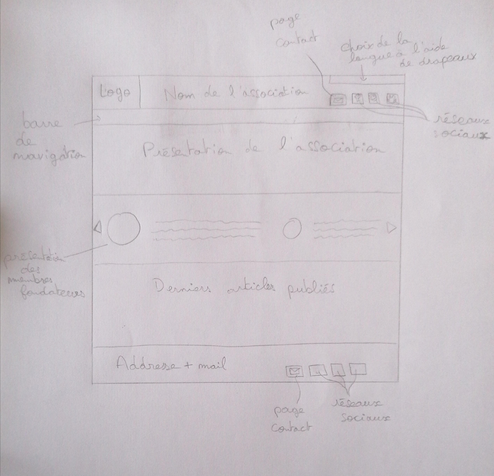

# Programmation Web 2 - Architecture choisie

## Schéma du site
------------------------------

### Quelques précisions

- La présentation de l'association aura un fond crème (comme le reste du site) avec le caducée en gris clair en fond.
- Le site sera principalement en vert et crème.
- 3 langues seront disponibles : français, anglais et allemend.
- La barre de navigation donnera accès à la liste de tous les événements passés, une page contenant une présentation de tous les memebres de toute l'association ainsi que toute l'info technique et une page contact.
- La présentation des membres fondateurs se fera sur la page d'accueil.

## Architecture de la BDD

En ce qui concerne la BDD, j'utilise une table pour récupérer les données du formulaire de contect.
